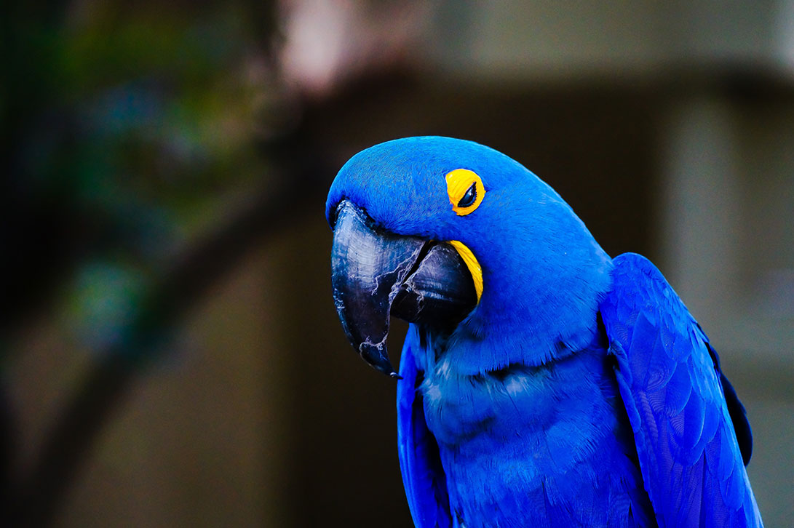

# macaw <small>0.1</small>

> Macaws are long-tailed, often colorful New World parrots or  <em>CESAR Design System</em>.

[GitLab](https://gitlab.com/cesarbr/cesar-apps/macaw/macaw)
[Get Started](#macaw)

