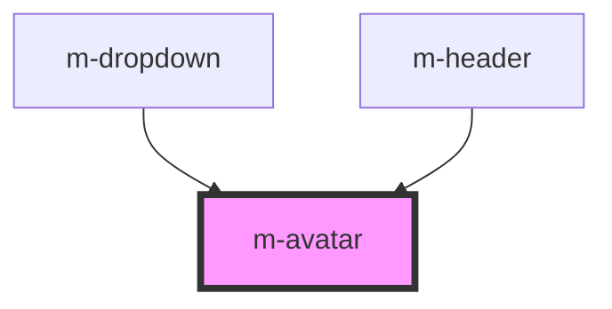

# m-avatar

This is a magic avatar or not ;)

<!-- Auto Generated Below -->

## Properties

| Property  | Attribute | Description              | Type     | Default     |
| --------- | --------- | ------------------------ | -------- | ----------- |
| `altDesc` | `alt`     | Alternative description. | `string` | `undefined` |
| `source`  | `source`  | Image URL or user name.  | `string` | `undefined` |

## Dependencies

### Used by

 - [m-dropdown](../m-dropdown)
 - [m-header](../m-header)

### Graph

----------------------------------------------

*Built with [StencilJS](https://stenciljs.com/)*
