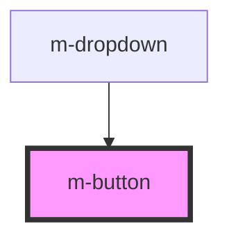

# m-button

This is a magic button or not ;)

<!-- Auto Generated Below -->

## Properties

| Property   | Attribute  | Description                      | Type      | Default     |
| ---------- | ---------- | -------------------------------- | --------- | ----------- |
| `disabled` | `disabled` | Disable button                   | `boolean` | `false`     |
| `tooltip`  | `title`    | Button tooltip                   | `string`  | `undefined` |
| `type`     | `type`     | Button type. "text" or "primary" | `string`  | `'primary'` |

## Methods

### `myTip() => Promise<string>`

Method showPrompt

#### Returns

Type: `Promise<string>`

## Dependencies

### Used by

 - [m-dropdown](../m-dropdown)

### Graph

----------------------------------------------

*Built with [StencilJS](https://stenciljs.com/)*
