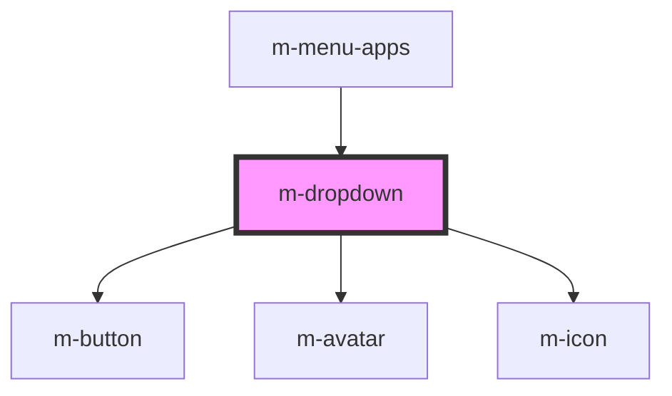

# m-dropdown

<!-- Auto Generated Below -->

## Properties

| Property           | Attribute             | Description                                                                                                                                     | Type      | Default                  |
| ------------------ | --------------------- | ----------------------------------------------------------------------------------------------------------------------------------------------- | --------- | ------------------------ |
| `avatarSource`     | `avatar-source`       | The logged user's avatar image URL or user name.                                                                                                | `string`  | `undefined`              |
| `dropdownButtonID` | `dropdown-button-i-d` | Unique ID.                                                                                                                                      | `string`  | `'mID-' + setUniqueID()` |
| `icon`             | `icon`                | Icon to display                                                                                                                                 | `string`  | `undefined`              |
| `iconType`         | `icon-type`           | Icon type to display                                                                                                                            | `string`  | `undefined`              |
| `label`            | `label`               | Dropdown label                                                                                                                                  | `string`  | `undefined`              |
| `showChevron`      | `show-chevron`        | Whether to display the chevron icon or not                                                                                                      | `boolean` | `true`                   |
| `showLabel`        | `show-label`          | Whether to display the button label or not. In case of using image or icon it's still need to provide a button label for accessibility reasons. | `boolean` | `true`                   |
| `type`             | `type`                | Dropdown button type: `text` or `primary`                                                                                                       | `string`  | `'primary'`              |

## Dependencies

### Used by

 - [m-menu-apps](../m-menu-apps)

### Depends on

- [m-button](../m-button)
- [m-avatar](../m-avatar)
- [m-icon](../m-icon)

### Graph

----------------------------------------------

*Built with [StencilJS](https://stenciljs.com/)*
