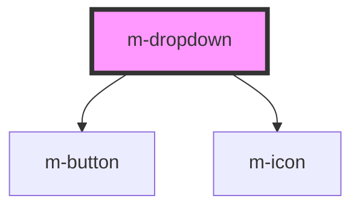

# m-dropdown

<!-- Auto Generated Below -->

## Properties

| Property | Attribute | Description    | Type     | Default     |
| -------- | --------- | -------------- | -------- | ----------- |
| `label`  | `label`   | Dropdown label | `string` | `undefined` |

## Dependencies

### Depends on

- [m-button](../m-button)
- [m-icon](../m-icon)

### Graph

----------------------------------------------

*Built with [StencilJS](https://stenciljs.com/)*
