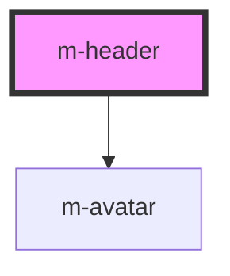

# m-header

This is a magic header or not ;)

<!-- Auto Generated Below -->

## Properties

| Property       | Attribute       | Description                                           | Type     | Default     |
| -------------- | --------------- | ----------------------------------------------------- | -------- | ----------- |
| `avatarName`   | `avatar-name`   | /**  The logged user's name                           | `string` | `undefined` |
| `avatarSource` | `avatar-source` | /**  The logged user's avatar image URL or user name. | `string` | `undefined` |
| `brandName`    | `brand-name`    | Brand name                                            | `string` | `undefined` |

## Dependencies

### Depends on

- [m-avatar](../m-avatar)

### Graph

----------------------------------------------

*Built with [StencilJS](https://stenciljs.com/)*
