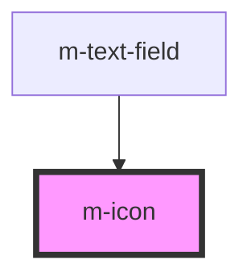

# m-icon

This is a magic icons package or not ;)

<!-- Auto Generated Below -->

## Properties

| Property  | Attribute | Description   | Type     | Default     |
| --------- | --------- | ------------- | -------- | ----------- |
| `name`    | `name`    | The icon name | `string` | `undefined` |
| `tooltip` | `title`   | Icon tooltip  | `string` | `undefined` |

## Dependencies

### Used by

 - [m-text-field](../m-text-field)

### Graph

----------------------------------------------

*Built with [StencilJS](https://stenciljs.com/)*
