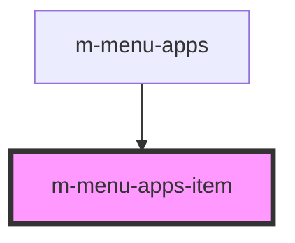

# m-avatar

This is a magic avatar or not ;)

<!-- Auto Generated Below -->

## Properties

| Property   | Attribute   | Description                           | Type     | Default     |
| ---------- | ----------- | ------------------------------------- | -------- | ----------- |
| `imgAlt`   | `img-alt`   | Menu item image alternate description | `string` | `undefined` |
| `imgSrc`   | `img-src`   | Menu item image source                | `string` | `undefined` |
| `itemName` | `item-name` | Menu item caption                     | `string` | `undefined` |
| `link`     | `link`      | Menu item link                        | `string` | `undefined` |

## Dependencies

### Used by

 - [m-menu-apps](../m-menu-apps)

### Graph

----------------------------------------------

*Built with [StencilJS](https://stenciljs.com/)*
