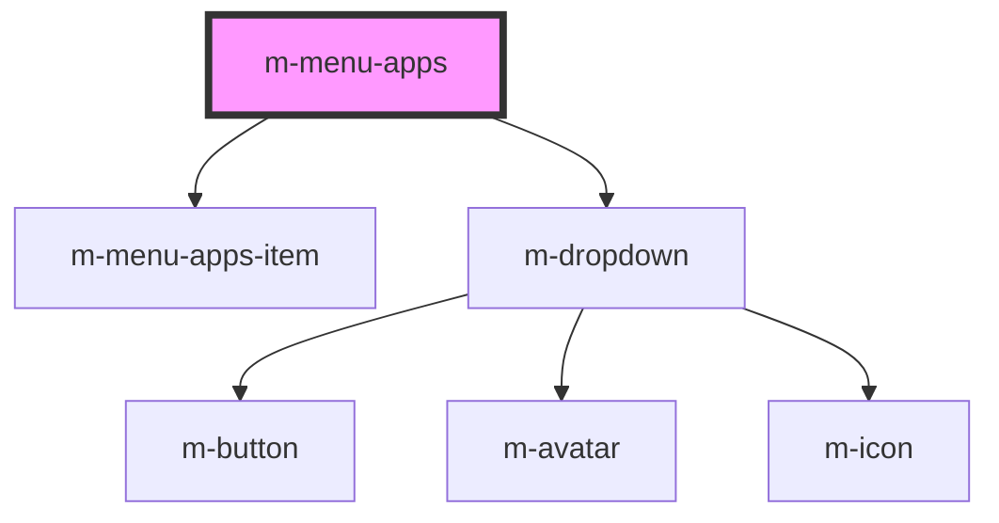

# m-menu-apps

This is a magic avatar or not ;)

<!-- Auto Generated Below -->

## Properties

| Property        | Attribute         | Description              | Type     | Default     |
| --------------- | ----------------- | ------------------------ | -------- | ----------- |
| `label`         | `label`           | Menu label               | `string` | `undefined` |
| `menuItemsJson` | `menu-items-json` | Menu Item items data.    | `string` | `undefined` |
| `type`          | `type`            | Menu type (grid or list) | `string` | `'grid'`    |

## Dependencies

### Depends on

- [m-menu-apps-item](../m-menu-apps-item)
- [m-dropdown](../m-dropdown)

### Graph

----------------------------------------------

*Built with [StencilJS](https://stenciljs.com/)*
