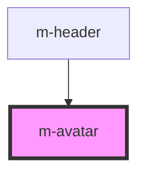

# m-avatar

This is a magic avatar or not ;)

<!-- Auto Generated Below -->

## Properties

| Property | Attribute | Description         | Type      | Default |
| -------- | --------- | ------------------- | --------- | ------- |
| `active` | `active`  | Set item as active. | `boolean` | `false` |

## Dependencies

### Used by

 - [m-header](../m-header)

### Graph

----------------------------------------------

*Built with [StencilJS](https://stenciljs.com/)*
