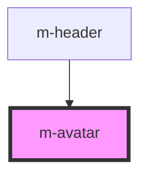

# m-avatar

This is a magic avatar or not ;)

<!-- Auto Generated Below -->

## Properties

| Property        | Attribute       | Description                     | Type     | Default  |
| --------------- | --------------- | ------------------------------- | -------- | ---------|
| `navItems`      | -               | Array with items content.       | `array`  | -        |
| `selectedIndex` | `selected-index`| Initial selected item (index 0).| `number` | 0        |

## Dependencies

### Used by

 - [m-header](../m-header)

### Graph

----------------------------------------------

*Built with [StencilJS](https://stenciljs.com/)*
