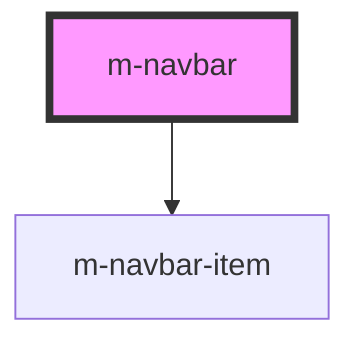

# m-navbar

This is a magic navbar or not ;)

<!-- Auto Generated Below -->

## Properties

| Property        | Attribute        | Description                    | Type      | Default     |
| --------------- | ---------------- | ------------------------------ | --------- | ----------- |
| `active`        | `active`         | Whether item is active.        | `boolean` | `undefined` |
| `navItems`      | --               | Navbar items.                  | `[]`      | `undefined` |
| `selectedIndex` | `selectedIndex` | Index of selected Navbar item. | `number`  | `0`         |

## Dependencies

### Depends on

- [m-navbar-item](../m-navbar-item)

### Graph

----------------------------------------------

*Built with [StencilJS](https://stenciljs.com/)*
