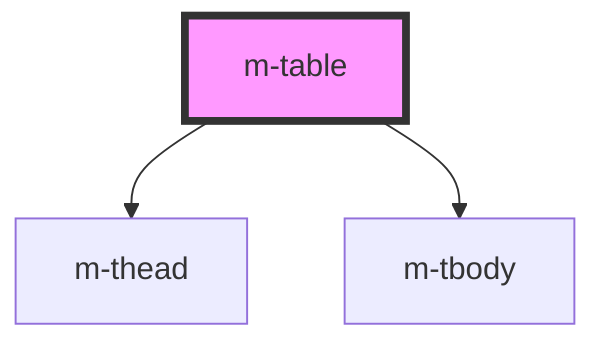

# m-table

This is a magic table or not ;)

<!-- Auto Generated Below -->

## Properties

| Property      | Attribute | Description   | Type      | Default     |
| ------------- | --------- | ------------- | --------- | ----------- |
| `data`        | --        | Data Table    | `[]`      | `undefined` |
| `dataHeaders` | --        | Table Headers | `[]`      | `undefined` |
| `strip`       | `strip`   | Table Strip   | `boolean` | `false`     |

## Dependencies

### Depends on

- [m-thead](../m-thead)
- [m-tbody](../m-tbody)

### Graph

----------------------------------------------

*Built with [StencilJS](https://stenciljs.com/)*
