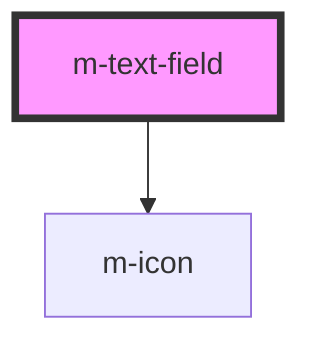

# m-text-field

<!-- Auto Generated Below -->

## Properties

| Property      | Attribute     | Description             | Type      | Default     |
| ------------- | ------------- | ----------------------- | --------- | ----------- |
| `disabled`    | `disabled`    | Disable field           | `boolean` | `false`     |
| `placeholder` | `placeholder` | Field placeholder       | `string`  | `undefined` |
| `type`        | `type`        | Type field              | `string`  | `'text'`    |
| `valid`       | `valid`       | Field validation status | `boolean` | `true`      |
| `value`       | `value`       | Field value             | `string`  | `undefined` |

## Dependencies

### Depends on

- [m-icon](../m-icon)

### Graph

----------------------------------------------

*Built with [StencilJS](https://stenciljs.com/)*
