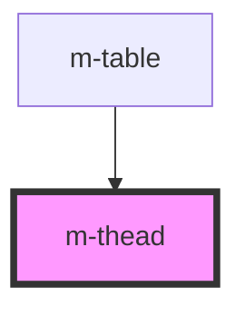

# m-thead

This is a magic thead or not ;)

<!-- Auto Generated Below -->

## Properties

| Property | Attribute | Description  | Type | Default     |
| -------- | --------- | ------------ | ---- | ----------- |
| `header` | --        | Table Header | `[]` | `undefined` |

## Dependencies

### Used by

 - [m-table](../m-table)

### Graph

----------------------------------------------

*Built with [StencilJS](https://stenciljs.com/)*
